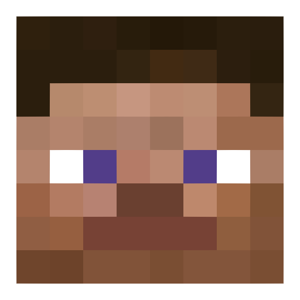

<div align="center">
  
  <p>explore and interact with minecraft player skins</p>
</div>

**Minecraft Skins** is a simple web tool for searching Minecraft player skins using their username. It displays a live 3D model of the skin with interactive features like rotation, movement toggle, and skin downloading. built with HTML, CSS, and JavaScript, it's an educational project focused on API usage and UI experimentation.

### features

- search for player skins by username.
- live 3D skin rendering with rotation and movement toggle.
- download or apply the skin directly via Minecraft’s website.
- explore alternate views of the skin.

### roadmap

- improve UI/UX aesthetics.
- add a search history feature using local storage.

### getting started

1. clone this repository:

```bash
git clone https://github.com/dieggoyz/minecraft-skins
```

2. open `index.html` in your preferred browser.

### license

this project is released under the [MIT license](LICENSE).  
it's an experimental and non-commercial project designed for fun and learning.

### thanks to

- [MineTools: Minecraft profile data](https://api.minetools.eu/)
- [NickAc: skin renders](https://nmsr.nickac.dev)
- [PlayerDB: player fetching API service](https://playerdb.co/)
- [skinview3d: three.js powered skin viewer](https://github.com/bs-community/skinview3d)

### contact

feedback or suggestions to [dieggoyz@gmail.com](mailto:dieggoyz@gmail.com)!
